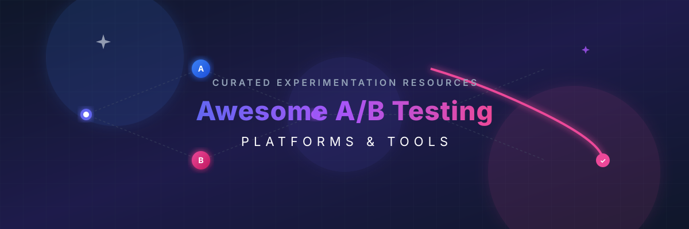

  

# 🧪 Awesome A/B Testing Platform

  

> A curated directory of the best **A/B Testing Platforms**, **Feature Flag Management tools**, and **Experimentation Software** (both commercial SaaS and self-hosted Open-Source solutions). Perfect for conversion rate optimization (CRO), product analytics, progressive delivery, and statistical testing.

## 🔍 Similar Projects to A/B Testing Platforms

**A/B Testing & Experimentation Platforms** enable teams to run controlled experiments (A/B, multivariate, feature experiments), manage feature flags, measure statistical significance, and optimize product or marketing experiences. Leading commercial tools include Optimizely, VWO, AB Tasty, Kameleoon, Convert, LaunchDarkly, Eppo, Statsig, Dynamic Yield, Adobe Target, and related offerings.

Below is a **curated list** of notable platforms and their open-source equivalents. The emphasis is on **open-source** and open-core solutions that support self-hosting, feature flags, experimentation, and statistical analysis.

## 🏢 SaaS / Hosted Platforms

| Platform | Description | Pricing & Free Tier Limits | Company Size |
| :--- | :--- | :--- | :--- |
| **[Adobe Target](https://business.adobe.com/products/target/adobe-target.html)** | Enterprise personalization and A/B testing solution within the Adobe Experience Cloud. | Custom quote (Enterprise-level). Free tier: None. | Huge/Enterprise (Adobe parent: ~$26.5B revenue) |
| **[LaunchDarkly](https://launchdarkly.com/)** | Leading feature management platform with strong experimentation capabilities (LaunchDarkly Experiments). | Starts at $8.33/user/mo. Free tier: Developer Tier (1 project, 3 environments, limited MAU & experimentation keys). | $3 Billion valuation |
| **[Optimizely](https://www.optimizely.com/)** | Enterprise experimentation and digital experience platform with advanced A/B testing, personalization, and feature management. | Enterprise pricing (Starts ~$36,000/yr). Free tier: Basic feature flagging only (excludes A/B testing). | $1.16 Billion valuation (>$400M ARR) |
| **[Statsig](https://www.statsig.com/)** | High-scale experimentation and feature management platform (now associated with OpenAI). | Usage-based pricing. Free tier: Developer Tier (up to 2 million events/month, unlimited seats & flags). | $1.1 Billion valuation (Acquired by OpenAI) |
| **[Dynamic Yield](https://www.dynamicyield.com/)** (Mastercard) | Personalization and experimentation platform. | Custom quote (Starts ~$35,000/yr). Free tier: None. | $300 Million acquisition valuation |
| **[AB Tasty](https://www.abtasty.com/)** | Experimentation and personalization platform focused on marketing and product teams. | Custom quote (Starts ~$30,000/yr). Free tier: None. | ~$116.8 Million valuation |
| **[VWO](https://vwo.com/)** | Conversion optimization platform with visual editor, A/B testing, heatmaps, and session insights. | Custom quote. Free tier: None (offers 30-day free trial). | ~$64 Million ARR |
| **[Kameleoon](https://www.kameleoon.com/)** | AI-powered A/B testing and personalization platform. | Custom quote / Starter plan (~$495/mo). Free tier: None (offers 30-day free trial). | ~$21.4 Million valuation |
| **[Eppo](https://www.geteppo.com/)** | Modern warehouse-native experimentation platform popular with data and product teams. | Custom quote (Starts ~$12,000–$30,000/yr). Free tier: None. | Acquired by Datadog |
| **[Convert](https://www.convert.com/)** / Convert Experiences | Privacy-focused A/B testing and experimentation platform. | Growth ($299/mo), Pro ($499/mo), Enterprise (Custom). Free tier: None (offers 15-day free trial). | ~$3.2 Million ARR |

## 🔓 Open-Source Software

- **[PostHog](https://github.com/PostHog/posthog)**  — Open-source product analytics platform that includes robust A/B testing / experimentation, feature flags, session replay, and surveys. Excellent all-in-one self-hosted option.
- **[Unleash](https://github.com/Unleash/unleash)**  — Popular open-source feature flag management system with experimentation support. Self-hostable with a strong focus on progressive delivery.
- **[GrowthBook](https://github.com/growthbook/growthbook)**  — Fully open-source (MIT) feature flagging and A/B testing platform. Warehouse-native (connects to BigQuery, Snowflake, Redshift, etc.), powerful statistical engine (Bayesian, frequentist, CUPED, sequential testing), visual editor (on some tiers), and self-hostable. One of the strongest open-source alternatives to commercial experimentation tools.
- **[Flagsmith](https://github.com/Flagsmith/flagsmith)**  — Open-source feature flags, remote config, and A/B testing platform. Supports self-hosting and multivariate flags.
- **[Flagr (openflagr)](https://github.com/openflagr/flagr)**  — Lightweight open-source feature flagging, A/B testing, and dynamic configuration microservice written in Go.
- **[GO Feature Flag](https://gofeatureflag.org/)**  — Fully open-source (MIT) feature flag solution with A/B experimentation support, data exporters, and OpenFeature compatibility. No database required for basic use.
- **[Wasabi](https://github.com/intuit/wasabi)**  — Open-source A/B testing platform originally from Intuit (older but still referenced).
- **[flagd](https://github.com/open-feature/flagd)**  — OpenFeature reference implementation / feature flag daemon (Apache 2.0). Headless and highly flexible.
- **[FeatureHub](https://github.com/featurehub-io/featurehub)**  — Cloud-native open-source feature flag, A/B testing, and remote configuration service with real-time streaming updates and multi-language SDKs.

### 🛠️ Supporting Standards & Ecosystem
- **[OpenFeature](https://openfeature.dev/)** — Vendor-neutral open standard and SDKs for feature flags. Allows switching between providers (including many of the tools above) without rewriting application code.

### ⚙️ Typical Open-Source Stack
Many teams combine:
1. **Experimentation + Stats** — GrowthBook (warehouse-native analysis)
2. **Feature Flags + Delivery** — Unleash, Flagsmith, or GO Feature Flag
3. **Product Analytics + Experiments** — PostHog
4. **Standards layer** — OpenFeature for portability

This approach provides full data ownership, avoids vendor lock-in, and delivers enterprise-grade experimentation capabilities at significantly lower cost.

---

**🤝 How to contribute**  
Fork this repository, add a new project (with link + short description + category), and open a pull request.  
Prefer actively maintained open-source projects that support A/B testing, feature flags, or statistical experimentation.

**📜 License**  
This list is public domain / CC0. Feel free to copy into your own awesome list or README.

Star the projects you find useful — open-source experimentation tooling keeps getting better! 🧪

##  Star History

<a href="https://www.star-history.com/?repos=ishandutta2007%2FAwesome-A-B-Testing-Platform&type=date&legend=bottom-right">
<picture>
<source media="(prefers-color-scheme: dark)" srcset="https://api.star-history.com/chart?repos=ishandutta2007/Awesome-A-B-Testing-Platform&type=date&theme=dark&legend=bottom-right" />
<source media="(prefers-color-scheme: light)" srcset="https://api.star-history.com/chart?repos=ishandutta2007/Awesome-A-B-Testing-Platform&type=date&legend=bottom-right" />

</picture>
</a>

